<!--
  Profile README for GitHub: drop this into a repo named exactly your username.
  Author: Steve (aka @renegade2k6)
  Vibe: Futuristic, polished, no-nonsense.
-->

<!-- ========= HERO ========= -->

  <!-- Gradient SVG Title (cleaned) -->
  <svg width="100%" height="100" viewBox="0 0 1200 100" xmlns="http://www.w3.org/2000/svg" role="img" aria-label="Steve / @renegade2k6">
    <defs>
      <linearGradient id="grad" x1="0" x2="1" y1="0" y2="0">
        <stop offset="0%" stop-color="#00E5FF"/>
        <stop offset="50%" stop-color="#7C3AED"/>
        <stop offset="100%" stop-color="#FF2D55"/>
      </linearGradient>
      <filter id="glow">
        <feGaussianBlur stdDeviation="3.5" result="coloredBlur"/>
        <feMerge>
          <feMergeNode in="coloredBlur"/>
          <feMergeNode in="SourceGraphic"/>
        </feMerge>
      </filter>
    </defs>
    <text x="50%" y="68%" text-anchor="middle" font-size="48" font-family="Segoe UI, Inter, system-ui, -apple-system, sans-serif" font-weight="800" fill="url(#grad)" filter="url(#glow)">
      Steve / @renegade2k6
    </text>
  </svg>

  <!-- Quick badges -->
  

    
    
    
    
  

  <!-- Typing SVG (updated & unclipped) -->
  

<!-- ========= NAV ========= -->

  <a href="#-about">About</a> •
  <a href="#-featured-projects">Featured Projects</a> •
  <a href="#-stats">Stats</a> •
  <a href="#-connect">Connect</a>

<!-- ========= ABOUT ========= -->
<h2 id="-about">👋 About</h2>

I’m Steve — better known online as <strong>Renegade2k6</strong>. 
I build, break, and rebuild because I can’t sit still when an idea hits.

What I’m about:
<ul>
  <li>🎮 Digging into <em>Last Fortress Underground</em> and surfacing updates before the devs want you to see them.</li>
  <li>🤖 Experimenting with AI tools, local models, and web apps that make sense of the chaos.</li>
  <li>📝 Running projects that mix <strong>fairness, creativity, and a bit of rebellion</strong> — I don’t do bloat, I do results.</li>
  <li>⚡ Motto: <em>“Ship it sharp. Fix it fast. Keep it honest.”</em></li>
</ul>

Right now my focus is on two live projects:
<ul>
  <li>🎮 <strong><a href="https://renegade2k6.github.io/LFULeaks/">LFU Leaks</a></strong> — a static viewer for game update leaks.</li>
  <li>🤖 <strong><a href="https://renegade2k6.github.io/ai-coding-hub/">AI Coding Hub</a></strong> — a curated hub for AI tools, CLIs, and runtimes.</li>
</ul>

<!-- ========= FEATURED PROJECTS ========= -->
<h2 id="-featured-projects">🚀 Featured Projects</h2>

<table>
  <tr>
    <td>
      <h3>🎮 <a href="https://renegade2k6.github.io/LFULeaks/">Last Fortress Underground Game Leaks</a></h3>
      Static diff viewer + index generator for game data updates. 
      No backend, blazing-fast GitHub Pages deployment.  
      
      
      
    </td>
  </tr>
  <tr>
    <td>
      <h3>🤖 <a href="https://renegade2k6.github.io/ai-coding-hub/">AI Coding Hub</a></h3>
      Curated collection of AI tools, CLI utilities, and providers with OG previews. 
      Futuristic theme, clean UI cards, ready-to-share assets.  
      
      
      
    </td>
  </tr>
</table>

<!-- ========= STATS ========= -->
<h2 id="-stats">📊 Stats</h2>

  

  <!-- Self-hosted cards (updated nightly by GitHub Action) -->
  

<!-- ========= CONNECT ========= -->
<h2 id="-connect">🔗 Connect With Me</h2>

<table align="center">
  <tr>
    <td align="center">
      
    </td>
    <td align="center">
      
    </td>
    <td align="center">
      
    </td>
  </tr>
</table>

<i>“Say no to bloat. Ship the tool. Polish the edge.”</i> ⚡

